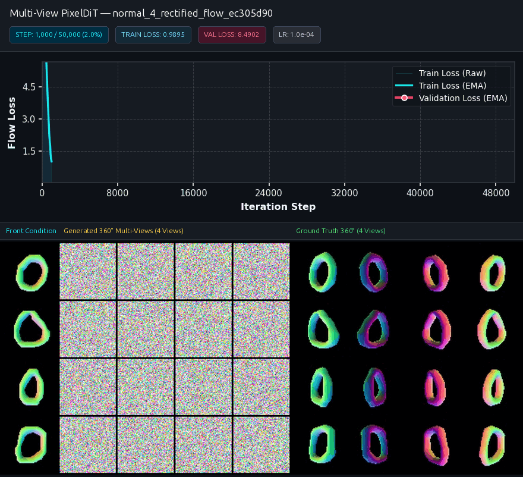
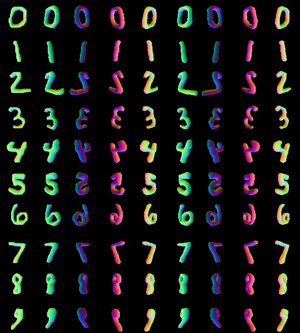

# Digit3D-MV: Multi-View Differentiable Geometry Generation

<p align="center">
  
</p>

<p align="center">
  <a href="https://pytorch.org/"></a>
  <a href="https://github.com/KhoiDOO/conquer3d"></a>
  <a href="https://github.com/KhoiDOO/digit3dmv/blob/main/LICENSE"></a>
</p>

---

## 📌 Introduction & Purpose

**Digit3D-MV** is a deep generative benchmark for simultaneous **360° multi-view 3D surface geometry synthesis** (surface normal maps and depth fields) conditioned on a single front view. 

By combining **Continuous Flow Matching** (Rectified Flow / Mean Flow) with a **Dual-Level PixelDiT** architecture equipped with **3D Rotary Position Embeddings (3D-RoPE)**, Digit3D-MV synthesizes topologically consistent multi-view normal geometries in only **20–25 Euler integration steps** (`23.0+ dB` Normal PSNR, `< 1.1°` Median Angular Error).

---

## 🎬 Visual Showcase

### 360° Multi-View Generation Matrix (All Digit Classes 0–9)
Conditioned on a single front normal map, the model synthesizes all 4 equatorial azimuth angles ($45^\circ, 135^\circ, 225^\circ, 315^\circ$):

<p align="center">
  
</p>

---

## 🚀 Installation

### 1. Clone & Set Up Conda Environment
```bash
git clone https://github.com/KhoiDOO/digit3dmv.git
cd digit3dmv

conda create -n digit3dmv python=3.11 -y
conda activate digit3dmv
```

### 2. Install CUDA Toolkit 12.8.2
```bash
conda install -c nvidia cuda-toolkit=12.8.2 -y
```

### 3. Install PyTorch with CUDA 12.8 Support
```bash
pip install torch torchvision --index-url https://download.pytorch.org/whl/cu128
```

### 4. Install Core Framework & Dependencies
```bash
pip install conquer3d --no-build-isolation

pip install rectified-flow-pytorch einops tqdm pillow matplotlib scipy trimesh gdown
```

### 5. Install Differentiable Rasterizer (Optional, for Data Rendering)
```bash
pip install ninja
pip install git+https://github.com/NVlabs/nvdiffrast.git
```

---

## 📖 Instructions & Usage

### 1. Render Multi-View Dataset (Optional)
Render 70,000 meshes across 4 or 12 views with surface normals and depth:
```bash
# Render 64x64 multi-view dataset
python data/render_mv.py --resolution 64 --num_views 4 --out_dir data/mv_64
```

### 2. Train Flow Matching Model
Train dual-level `MVPixelDiT` using Rectified Flow:
```bash
python main.py \
  --mode rectified_flow \
  --modality normal \
  --resolution 64 \
  --num_views 4 \
  --patch_size 4 \
  --hidden_size 256 \
  --batch_size 32 \
  --max_iters 50000 \
  --lr 1e-4
```

### 3. Generate Multi-View Samples
Sample multi-view grids from a trained experiment directory:
```bash
python generate.py \
  --exp_dir outputs/normal_4_rectified_flow_ec305d90 \
  --sample_steps 25 \
  --full_class
```

### 4. Quantitative Geometric Evaluation
Evaluate Normal Consistency (MAE, MedAE, PSNR, SSIM, angular accuracy):
```bash
# Evaluate overall normal consistency across views and classes
python eval.py --exp_dir outputs/normal_4_rectified_flow_ec305d90

# Benchmark ODE integration step count vs. PSNR and latency
python eval_step.py --exp_dir outputs/normal_4_rectified_flow_ec305d90 --steps 2 5 10 20 25 50 100
```

### 5. Synthesize Training Evolution GIFs
```bash
# Synchronized with dynamic loss curves and badges
python make_gif.py --exp_dir outputs/normal_4_rectified_flow_ec305d90 --show_loss --fps 8

# Pure multi-view sample animation
python make_gif.py --exp_dir outputs/normal_4_rectified_flow_ec305d90 --fps 8
```

---

## 🙏 Acknowledgements

We sincerely thank and acknowledge the outstanding open-source projects and repositories that supported and inspired this work:

- [Conquer3D](https://github.com/KhoiDOO/conquer3d) — Differentiable geometry engine, mesh rendering pipelines, and 3D primitives.
- [rectified-flow-pytorch](https://github.com/lucidrains/rectified-flow-pytorch) — Elegant continuous flow matching framework in PyTorch.
- [rotary-embedding-torch](https://github.com/lucidrains/rotary-embedding-torch) — Rotary Position Embeddings (RoPE) implementation.
- [nvdiffrast](https://github.com/NVlabs/nvdiffrast) — NVIDIA's high-performance differentiable rasterization library.
- [PixelDiT](https://github.com/Zhendong-Wang/PixelDiT) — Dual-level patch- and pixel-space diffusion transformer foundations.
- [Academic Project Page Template](https://github.com/Academic-project-page-template/Academic-project-page-template.github.io) — Research project presentation template.

---

## 📄 License
This project is open-source under the [MIT License](LICENSE).