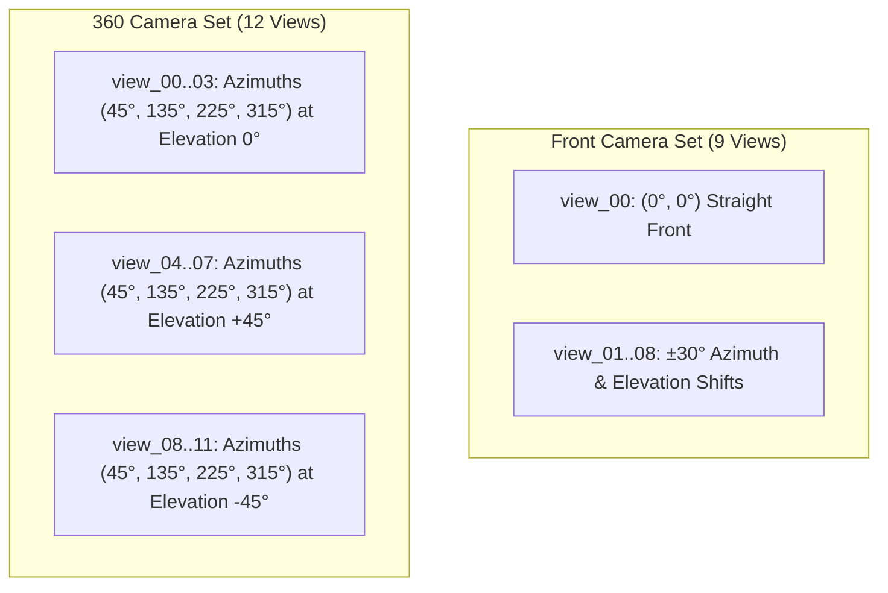

# Digit3D Multi-View (Digit3DMV) Dataset Specifications & Conventions

This document specifies the geometric, optical, coordinate, and mathematical conventions used across the **Digit3DMV** dataset.

---

## 1. 3D Spatial Coordinate Frame & Geometry Conventions

The dataset is constructed in a standard **Right-Handed Cartesian Coordinate System** with **$+Z$ pointing Upward**:

| Axis | Semantic Meaning | Spatial Extent | Mapping from 2D MNIST Bitmap |
| :--- | :--- | :--- | :--- |
| **$+X$** | **Width** (Horizontal Right) | $[-1.2, +1.2]$ | $u = \frac{x}{1.2} \in [-1, 1]$ (image columns) |
| **$+Y$** | **Extrusion / Thickness** | $[-0.6, +0.6]$ | Extrusion axis (symmetric around origin) |
| **$+Z$** | **Height** (Vertical Upward) | $[-1.2, +1.2]$ | $v = -\frac{z}{1.2} \in [-1, 1]$ (upright digit orientation) |

- **Origin**: All digits are centered at $(0, 0, 0)$.
- **Bounding Volume**: All surface geometry is strictly contained within the cubic volume $[-1.2, 1.2]^3$.
- **Mesh Topology**: Watertight 2-manifold triangular meshes (`.obj`) generated via CUDA Marching Cubes, Quadric Error Decimation (500 triangles), and Taubin smoothing.

---

## 2. Camera Setup & Trajectories (21 Views)

All cameras look directly at the origin $(0, 0, 0)$ from a fixed radius $d_{\text{cam}} = 2.4$ with a vertical Field of View $\text{FOV} = 60.0^\circ$.

```
Camera Position: c(ϕ, θ) = [ d * cos(θ) * sin(ϕ),  -d * cos(θ) * cos(ϕ),  d * sin(θ) ]
```
where $\phi$ is the Azimuth angle (yaw around $+Z$) and $\theta$ is the Elevation angle (pitch above $XY$ plane).



### A. Front View Set (9 Views, $\Delta = \pm 30.0^\circ$)
- `front/view_00`: Straight canonical front view $(\phi = 0^\circ, \theta = 0^\circ)$ located at $(0.0, -2.4, 0.0)$.
- `front/view_01` to `front/view_08`: 8 surrounding angle perturbations with $\phi \in \{-30^\circ, 0^\circ, 30^\circ\}$ and $\theta \in \{-30^\circ, 0^\circ, 30^\circ\} \setminus \{(0, 0)\}$.

### B. 360 View Set (12 Views)
- **Equatorial Views ($\theta = 0^\circ$)**:
  - `360/view_00`: Azimuth $45^\circ$, Elevation $0^\circ$ (Front-Right)
  - `360/view_01`: Azimuth $135^\circ$, Elevation $0^\circ$ (Back-Right)
  - `360/view_02`: Azimuth $225^\circ$, Elevation $0^\circ$ (Back-Left)
  - `360/view_03`: Azimuth $315^\circ$, Elevation $0^\circ$ (Front-Left)
- **Top-Down Views ($\theta = +45^\circ$)**:
  - `360/view_04` to `360/view_07`: Azimuths $45^\circ, 135^\circ, 225^\circ, 315^\circ$ at $\theta = +45^\circ$.
- **Bottom-Up Views ($\theta = -45^\circ$)**:
  - `360/view_08` to `360/view_11`: Azimuths $45^\circ, 135^\circ, 225^\circ, 315^\circ$ at $\theta = -45^\circ$.

---

## 3. Mathematical Value Formulations & Recovery

### 1. Normal Maps
- **Definition**: World-space outward surface unit normals $\hat{\mathbf{n}} = (n_x, n_y, n_z) \in \mathbb{S}^2 \subset [-1.0, 1.0]^3$.
- **Color Encoding (Stored in JPEG / Dataset Tensor)**:
  $$\mathbf{C}_{\text{normal}} = \frac{\hat{\mathbf{n}} + 1.0}{2.0} \quad \in [0.0, 1.0]^3$$
  *(Background pixels where no surface is intersected are set to $0.0$, i.e. RGB $[0, 0, 0]$).*
- **Conversion back to physical 3D Unit Normal vectors**:
  ```python
  # tensor is float32 in [0.0, 1.0]
  unit_normals = normal_tensor * 2.0 - 1.0
  ```

### 2. Depth Maps
- **Physical Camera-Space Metric Depth ($z_{\text{cam}}$)**:
  Continuous Euclidean distance along the camera optical ray within the bounding box $[-1.2, 1.2]^3$:
  - Distance from camera to origin: $d_{\text{cam}} = 2.4$
  - Nearest possible surface depth: $z_{\text{near}} = d_{\text{cam}} - 1.2 = 1.2$
  - Farthest possible surface depth: $z_{\text{far}} = d_{\text{cam}} + 1.2 = 3.6$
  - Total bounding depth span: $\Delta z = 2.4$
- **Normalized Depth (Stored in JPEG / Dataset Tensor)**:
  $$\text{depth}_{\text{norm}} = \frac{z_{\text{cam}} - 1.2}{2.4} \quad \in [0.0, 1.0]$$
  *(Background pixels where no surface is intersected are set to $0.0$).*
- **Conversion back to physical metric depth ($z_{\text{cam}}$ in world units)**:
  ```python
  # depth_tensor is float32 in [0.0, 1.0]
  metric_depth = depth_tensor * 2.4 + 1.2  # Maps [0, 1] -> [1.2, 3.6]
  ```

---

## 4. PyTorch Dataset API (`conquer3d.data.Digit3DMV`)

The dataset is fully integrated into the `conquer3d` library:

```python
from conquer3d.data import Digit3DMV
from torch.utils.data import DataLoader

dataset = Digit3DMV(
    root="~/.conquer3d/",       # Directory with mv_64.zip / mv_128.zip or uncompressed folders
    resolution=64,              # 64 or 128
    train=True,                 # True (60k train) or False (10k test)
    modality="normal",          # "normal", "depth", or "both"
    all_360=False,              # False (4 views) or True (12 views)
    return_front_variation=True,# Returns 8 front angle variation views
    return_c2w=True,            # Returns 4x4 camera-to-world pose matrices
    use_zip=None,               # None (auto-detects), True (forces .zip), False (directory)
    cached=False                # In-memory RAM caching for fast training epochs
)

loader = DataLoader(dataset, batch_size=16, shuffle=True, num_workers=4)
batch = next(iter(loader))

print(batch['front'].shape)               # [16, 3, 64, 64]
print(batch['360'].shape)                 # [16, 4, 3, 64, 64]
print(batch['front_variation'].shape)     # [16, 8, 3, 64, 64]
print(batch['c2w_front'].shape)           # [16, 4, 4]
print(batch['c2w_360'].shape)             # [16, 4, 4, 4]
print(batch['c2w_front_variation'].shape) # [16, 8, 4, 4]
print(batch['label'].shape)               # [16]
```

---

## 5. Dataset File Structure

```
data/
├── mv_64.zip                            # 64x64 compressed archive (5.2 GB)
├── mv_128.zip                           # 128x128 compressed archive (9.0 GB)
├── mv_64/                               # 64x64 uncompressed dataset
│   ├── cameras.json                     # Canonical global camera metadata
│   ├── train/                           # 60,000 samples (2,520,000 images)
│   └── test/                            # 10,000 samples (420,000 images)
│       └── <label>_<index>/             # e.g., 0_10/
│           ├── cameras.json             # Per-sample camera parameters
│           ├── normal/
│           │   ├── front/               # view_00.jpg ... view_08.jpg
│           │   └── 360/                 # view_00.jpg ... view_11.jpg
│           └── depth/
│               ├── front/               # view_00.jpg ... view_08.jpg
│               └── 360/                 # view_00.jpg ... view_11.jpg
├── mv_128/                              # 128x128 uncompressed dataset
├── render_mv.py                         # nvdiffrast rendering pipeline script
├── construct.py                         # 2D MNIST -> 3D Mesh generator
├── run.sh                               # Full generation orchestrator
└── zip.sh                               # Dataset archiving script
```
